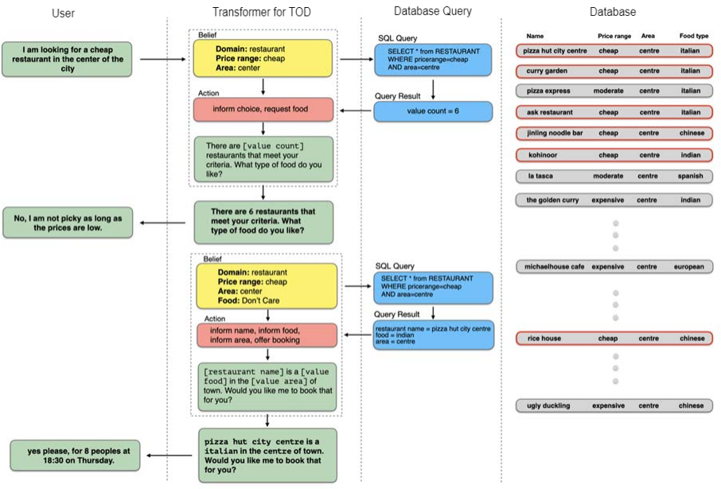
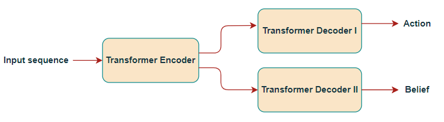
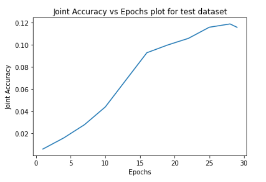
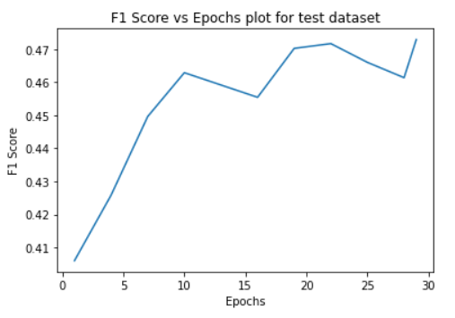
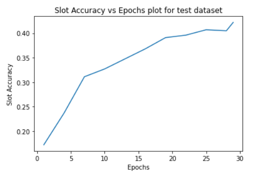

# Transformer for Task Oriented Dialogue Systems

## Introduction
Task-oriented dialogue (TOD) systems accomplish a goal described 
by a user in natural language. They often use a pipeline approach. 
Such approach requires natural language understanding (NLU) for belief state tracking, 
dialogue management (DM) for deciding which actions to take based on those beliefs, 
and natural language generation (NLG) for generating responses.

 Transformer for TOD uses the Transformer encoders and decoders to generate all outputs given the dialogue context and retrieved database search results. The delexicalized response can then be lexicalized into a human-readable response by using information from the belief state and DB search results.The flow chart of the system is shown below,

 

 Transformer fot TOD consists of a single transformer encoder followed by two joint transformer decoders, for predicting the actions and beliefs corresponding to a given dialogue context provided by the user.The metric for evaluation of the model for action prediction is precision and recall and for belief prediction is joint accuracy and slot accuracy. This approach improved the accuracy as compared to the previous single decoder based action and belief prediction approach. The architecture of the model is shown below :



## Dataset processing
After processing the MultiWoZ dataset we have got that each dialogue turn will be represented as a sequence, which contains previous user/system turns, belief and action :

```
<|endoftext|> <|context|> <|user|> i am looking for a college type attraction . <|system|> there are 18 colleges i have found , would you prefer 1 in town centre or in the west ? <|user|> i would like to visit on in town centre please . <|system|> sure , we have thirteen options , 10 of which are free . may i suggest king s college , or hughes hall ? <|user|> okay , may i have their postcode , entrance fee , and phone number ?<|endofcontext|> 
<|belief|> attraction type college , attraction name kings college|hughes hall , attraction area centre <|endofbelief|> 
<|action|> attraction inform name , attraction inform fee , attraction inform post , attraction inform phone <|endofaction|>

```

<h3>Results for Train and Validation data</h3>
<div class="datagrid" style="width:500px;">
<table>
<thead><tr><th></th><th>Train dataset</th><th>Validation dataset</th></tr></thead>
<tbody>
<tr><td> Final Loss </td><td>0.010447</td><td>0.087535</td></tr>
<tr><td> Joint Accuracy </td><td>32.35</td><td>22.36</td></tr>
<tr><td> Slot Accuracy </td><td>56.67</td><td>45.76</td></tr>
</tbody>
</table>
</div>

<h2>Table for Test data</h2>
<h3>Belief Tracking</h3>
<div class="datagrid" style="width:500px;">
<table>
<thead><tr><th></th><th colspan="2">MultiWOZ 2.0</th><th colspan="2">MultiWOZ 2.1</th><th colspan="2">MultiWOZ 2.2</th></tr></thead>
<thead><tr><th>Model</th><th>Joint Accuracy</th><th>Slot Accuracy</th><th>Joint Accuracy</th><th>Slot</th><th>Joint Accuracy</th><th>Slot Accuracy</th></tr></thead>
<tbody>
<tr><td> Transformer Model </td><td></td><td></td><td>21.67</td><td>40.42</td><td></td><td></td></tr>
</tbody>
</table>
</div>

<h3>Instructions for running codes</h3>

The data preprocessing file Data_preprocessing.ipynb file resides in the simpletod folder . You have to run all the code cells sequentially and finally it will generate six files containing datasets for train , test and validation in the Processed_data folder .

Next the whole model and code for train , test and validation resides in the train_and_accuracy.ipynb file in the simpletod folder . Here also you have to run all the cells sequentially for training the model . You can obtain the file cotaining the results of the test dataset in the form of context , predicted belief state corresponding to that context and target belief state corresponding to that context by running the test_and_accuracy.ipynb file . Note your model is also get saved in a file named dialog_NLP2.pt in the Processed_data folder so that you can use it for future purposes .  

Sample result dataset contaning context , predicted belief states , target belief states , joint accuracy for , slot accuracy for each batches and overall joint and slot accuracy for the test dataset is given in the Test_results.txt file in the Output folder .

<h1>Results for Joint Belief and Action Prediction Model</h1>


<h2>Table for Test data</h2>
<h3>Joint Belief and Action Tracking</h3>
<div class="datagrid" style="width:500px;">
<table>
<thead><tr><th></th><th colspan="5">MultiWOZ 2.1</th></tr></thead>
<thead><tr><th>Model</th><th>Joint Accuracy</th><th>Slot Accuracy</th><th>Precision</th><th>Recall</th><th>F1-score</th></tr></thead>
<tbody>
<tr><td> Joint Belief Action Model </td><td>15.08</td><td>42.77</td><td>51.42</td><td>43.21</td><td>46.91</td></tr>
</tbody>
</table>
</div>

<h2>Text Results Obtained</h2>
<h3>Context</h3>

<|context|> <|user|> i want to find a moderate -ly priced restaurant . <|system|> i have many options available for you ! is there a certain area or cuisine that interests you ? <|user|> yes i would like the restaurant to be located in the center of the attractions .<|endofcontext|>

<h3>Predicted Belief</h3>

<|belief|> restaurant pricerange moderate , restaurant area centre <|endofbelief|>

<h3>Predicted Action</h3>

<|action|> restaurant request food , restaurant inform choice , restaurant inform area <|endofaction|>

<h3>Target Belief</h3>

<|belief|> restaurant pricerange moderate , restaurant area centre <|endofbelief|>

<h3>Target Action</h3>

<|action|> restaurant request food , restaurant inform choice , restaurant inform area <|endofaction|>




